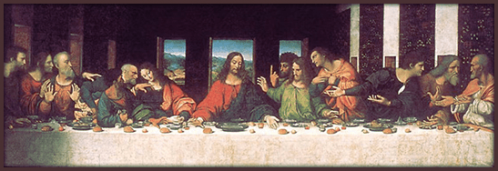

<h1 align="center">La Toile</h1>
<h3 align="center">Projet Symfony-Vue</h3>

Petit jeu de piste développé sur Symfony et Vue.

## Comment installer ?

### via Composer

[Composer](https://getcomposer.org/download/), [Symfony](https://symfony.com/download) et [Yarn](https://classic.yarnpkg.com/lang/en/docs/install/#debian-stable) doivent être installés sur votre machine au préalable.

Si vous avez la version PHP ^8.2 sur votre machine, clonez le projet sur votre machine, puis rentrez les commandes :
  `composer install`
 `yarn installer`
 `yarn encore dev`
 Puis lancez le programme avec `symfony serve`

### via Docker

Si vous avez Docker et docker-compose sur votre machine, clonez le projet et lancez à la racine du projet : `docker compose up --build -d`
.

Allez sur `http://localhost:8000` et bonne visite!